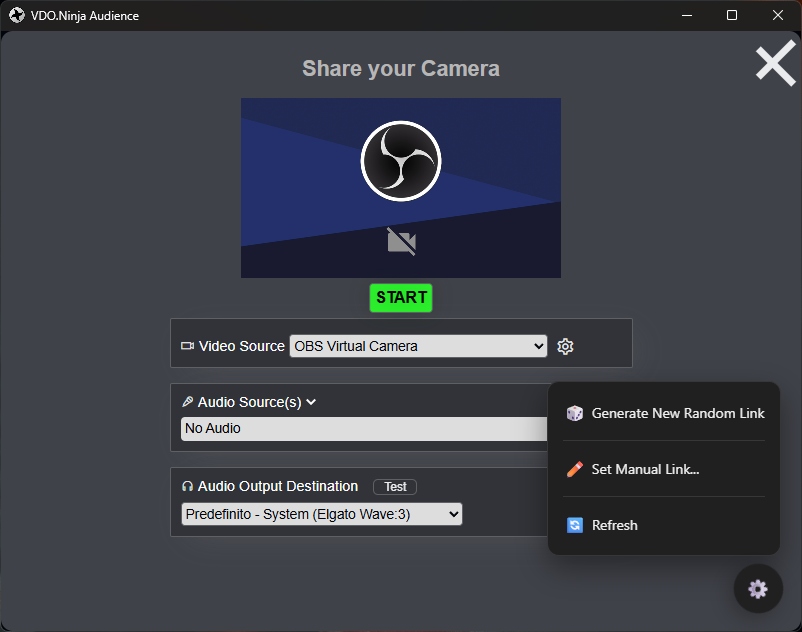

# VDO.Ninja Audience

This application provides a persistent, static link for your VDO.Ninja audience, simplifying the process of sharing your stream.



## Features

* **Static Link:** Generates a static link for your VDO.Ninja stream, so you don't have to share a new link every time.
* **Automatic Link Generation:** On first launch, a new random and secure VDO.Ninja link is automatically generated.
* **Manual Link Configuration:** You can manually set your own VDO.Ninja link, including a room name (Push ID) and an audience password.
* **Secure Storage:** The VDO.Ninja link is stored securely on your local machine using encryption.
* **Easy to Use:** A simple menu allows you to generate a new random link, set a manual link, or refresh the page.

## How to Use

1. **Launch the application:** The first time you launch the application, a new VDO.Ninja link will be generated and displayed.
2. **Share the link:** You can now share this link with your audience.
3. **Menu options:**
   * **Generate New Random Link:** Creates a new random and secure VDO.Ninja link.
   * **Set Manual Link...:** Opens a dialog to set a custom VDO.Ninja link with a room name and audience password.
   * **Refresh:** Reloads the current VDO.Ninja page.

## How to Build and Test

This project is built with [Tauri](https://tauri.app/).

### Prerequisites

* [Node.js](https://nodejs.org/)
* [Rust](https://www.rust-lang.org/)

### Development

To run the application in development mode, use the following command:

```bash
npm run tauri dev
```

### Build

To build the application for your platform, use the following command:

```bash
npm run tauri build
```

This will create an executable file in the `src-tauri/target/release` directory.
